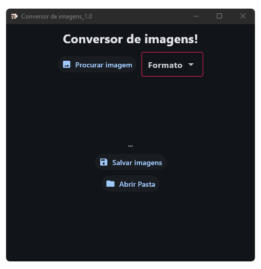
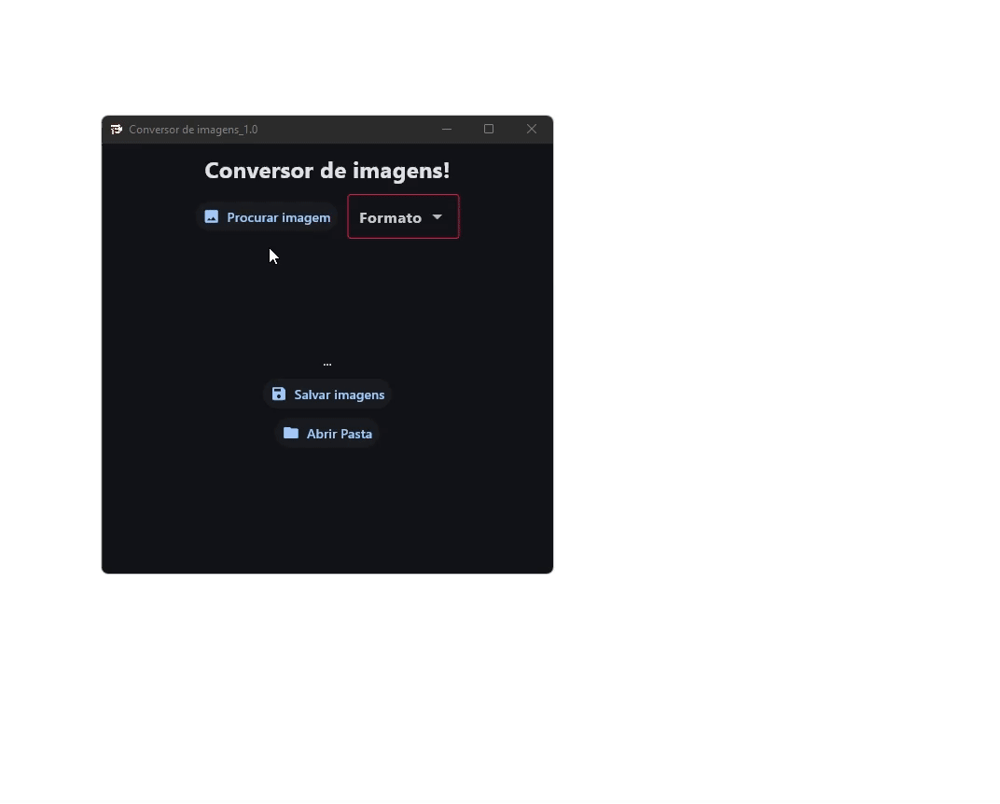

# Conversor de imagens

## Problema:

&nbsp;O cliente precisava adicionar mais de 200 imagens em formato WEBP ao Sistema Eletrônico de Informações (SEI) do Governo. No entanto, o SEI não suporta esse formato, e realizar a conversão manual em plataformas online era impraticável para um escritório com mais de 100 demandas similares.

## Objetivo:

- &nbsp;Automatizar a conversão de imagens em formato WEBP para formatos compatíveis com o SEI, agilizando o fluxo de trabalho e eliminando a necessidade de intervenções manuais repetitivas.

- &nbsp;Otimizar a produtividade do escritório de engenharia, garantindo que os funcionários possam focar em tarefas mais relevantes e estratégicas.

- &nbsp;Aproveitar a solução para explorar e compreender, na prática, uma arquitetura de software simples, com foco na integração e comunicação eficiente entre módulos do sistema.

## Sobe o Projeto:

&nbsp;O projeto é uma plataforma para converter imagens em outros formatos de arquivos.

### Formatos aceitos:

- PNG
- JPEG
- JPG
- BMP
- TIFF
- TIF
- RAW
- WEBP

### Como funciona:

## Tecnologias utilizadas:

- Python
- Flet

## Requisitos:

- Windows
- Descktop, notebook e outros, exceto dispositivos mobile.

## Equipe:

Leandro Camilo.

## Feedback Pessoal:

&nbsp;Desenvolver este software foi desafiador, especialmente no tratamento de strings obtidas de listas dentro de dicionários. Inicialmente, isso parecia complicado, mas acabou sendo uma ótima oportunidade de aprendizado. Consegui aprofundar meus conhecimentos em manipulação de dados no Python e superar dificuldades que reforçaram minha confiança e habilidades técnicas.

&nbsp;No final, fiquei satisfeito com a solução funcional e eficiente, além do aprendizado valioso adquirido no processo.
